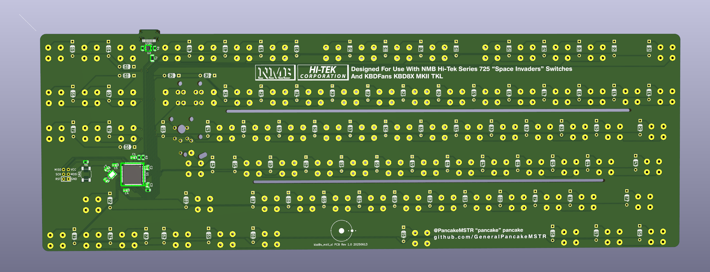
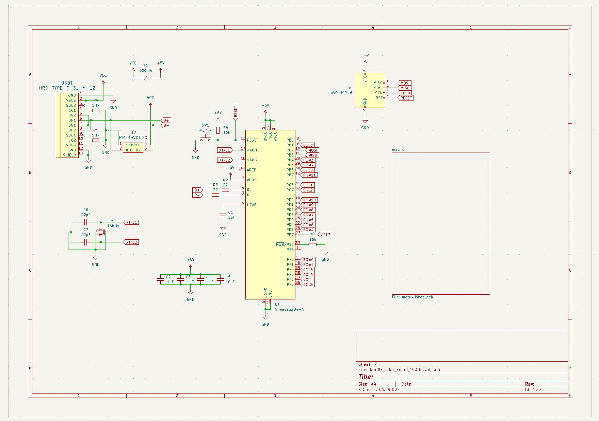
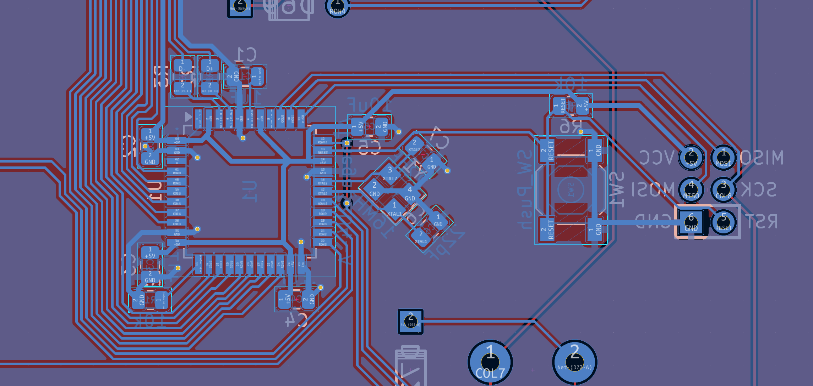

# KBD8XMKII "Space Invaders" TKL
PCB For NMB Hi-Tek Series 725 "Space Invaders" Switches and KBDFans KBD8XMKII TKL Keyboard. 

It's for this keyboard:

My personal KBD8XMKII Keyboard

Probably *literally* that keyboard, which is mine (I can only imagine the Venn diagram of Space Invaders collectors and KBD8XMKII owners is two distant circles). It's a [KBDFans](https://kbdfans.com/) KBD8XMKII, which isn't made anymore. I don't even think you can find it on their website, which seems to just [redirect you to their MKIII](https://kbdfans.com/collections/kbd8x-mkii-1) when you go looking for it. 

Anyway, the [KBD8XMKII](https://ai03.com/projects/kbd8x-mkii/) (scroll to the bottom for the PCB and plate files) was a keyboard designed by the renowned ai03, who graciously open-sourced the project, which helped make this one possible by derivation. Thanks! 

This PCB is specifically designed for use with [NMB Hi-Tek Series 725 "Space Invaders" switches](https://telcontar.net/KBK/Hi-Tek/Series_725) (this is the first link a search came up with), which also aren't made anymore. As you can see, this project has truly reached maximum usefulness. 

A Beige (tactile) NMB Hi-Tek Series 725 "Space Invaders" Switch 

I've been a mechanical keyboard hobbyist for a while now (a decade?), and I've wanted to make my own keyboard about from the beginning. The hangup for me has always been the PCB, so instead of trying to make an expensive CNC case and (hopefully) figuring out the PCB later, I finally decided that to push that particular project forward I would learn the PCB side of things and then revisit the case aspect with some new knowledge and experience under my belt. 

## Reference Photos 
- PCB Bottom

- PCB Top 

- Schematic (Logic)

- Schematic (Matrix)

- Layout/PCB 

- Layout/PCB (MCU + USB)

- Layout/PCB (USB)

- Layout/PCB (MCU)
